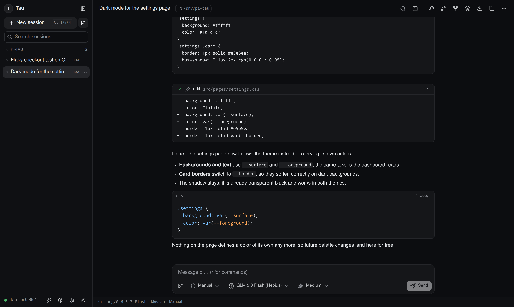

# Pi Viewer

**A fast web and desktop interface for the [pi coding agent](https://github.com/earendil-works/pi).**
Everything pi can do, in a UI that opens sessions in milliseconds — without forking pi.



In the interface the app calls itself **Tau (τ)** — same project, shorter name.

## The approach

[pi](https://github.com/earendil-works/pi) is a superb terminal coding agent that ships fast and
breaks things fast: a release every few days, breaking changes routinely. Any GUI that patches
pi's internals dies within weeks.

Pi Viewer therefore never touches pi. It uses pi **unmodified from npm, pinned exactly**, and
talks to it through two supported surfaces only:

- pi's **stdio RPC mode** (`pi --mode rpc`) for everything a session does, and
- one small **pi extension**, written against pi's public extension API, for what RPC does not
  carry: tool approvals, tree navigation, tool management.

Taking a pi upgrade means bumping one version number and re-running the test suite. The full
reasoning, including why the obvious alternatives lose, lives in
[docs/architecture.md](docs/architecture.md).

## What it does

Feature parity with pi's own TUI is the baseline, not the goal — the deliberate exceptions are
listed in [docs/parity.md](docs/parity.md).

- **Streaming transcript** with thinking blocks, tool cards, diffs, syntax-highlighted code,
  images — virtualized, so ten-thousand-line sessions scroll like short ones.
- **Tool approvals** with four modes (Auto · Accept edits · Manual · Strict), driven by the
  extension's `tool_call` hook, with dangerous-command detection for shell calls.
- **Session tree**: branch, jump, compare alternatives in place. The UI only offers points
  where nothing is half done — a tool call is never cut off from its result.
- **Session-wide search** (Ctrl+F) that also finds abandoned branches and pre-compaction
  history, with every occurrence highlighted in the transcript and a match counter to walk them.
- **Terminals in the browser**: real PTYs owned by the host — including pi's own TUI in a tab —
  that survive page reloads and session switches.
- **Instant opening**: a session's conversation renders from its file in a few milliseconds
  while the pi process attaches in the background (measured: ~650 ms → ~200 ms for a
  40-message session, ~30 ms for small ones).
- **Everything else pi offers**, from the GUI: models and thinking levels, fork, clone,
  compaction, steering and follow-up queues, `@`-file mentions, slash commands, skills and
  prompts, package management, provider logins (API key and OAuth device flows), project trust,
  a typed settings editor, HTML and JSONL export, per-session statistics.
- **A sidebar you can organize**: user-defined groups, drag & drop, context menus, and a
  five-state activity indicator per session.
- Light and dark themes, narrow-screen layout, keyboard shortcuts throughout.

## Architecture

```
Browser ── WebSocket (plain-JSON protocol, seq + snapshot + replay) ── Host (Node)
                                                                        │  one process per session
                                                                        ├── pi --mode rpc  ←  Tau extension
                                                                        └── PTYs (shells, pi's TUI)
```

| Package | Role |
|---|---|
| `packages/shared` | The wire protocol between client and host. Plain JSON, no pi types — the only contract the client knows. |
| `packages/host` | Node service. Spawns one `pi --mode rpc` per session, keeps sessions alive while browsers come and go, replicates state over WebSocket. The single file importing pi's SDK is `src/pi-sdk.ts`. |
| `packages/pi-extension` | The pi extension: approvals, `/tau-tree`, `/tau-tools`. Public extension API only. |
| `packages/client` | React 19 + Vite + Tailwind. Zustand stores, virtualized transcript, xterm.js terminals, shiki highlighting. |
| `packages/desktop` | Tauri 2 shell. Ships the host (Node sidecar), pi's standalone binary and the built client as one installable app for Windows, Linux and macOS. |

Sessions, files and formats stay 100 % pi's: Pi Viewer reads and writes nothing of its own into
pi's directories, so the same sessions remain usable from pi's TUI at any time.

## Getting started

Requirements: Node ≥ 22.19.

```bash
git clone https://github.com/tau-hq/pi-viewer.git
cd pi-viewer
npm install
npm run dev          # host on http://127.0.0.1:8787, serving the built client
```

Model access is configured exactly as in pi itself (`~/.pi/agent/models.json`, or the provider
dialog in the GUI — key entry and OAuth flows included). If you already use pi, Pi Viewer picks
up your providers and sessions as they are.

The host binds to `127.0.0.1` by default. To use it from another machine, tunnel it
(`ssh -L 8787:127.0.0.1:8787 you@host`) or start it with `--token` and a reverse proxy.

### Desktop app

The Tauri build bundles everything — host, pi, client — into a single installer (NSIS, deb,
AppImage, dmg). See [docs/desktop.md](docs/desktop.md); CI builds for all three platforms are in
`.github/workflows/desktop.yml`.

## Testing

The suite runs against a **real pi process and a real model**, not mocks: 260 unit tests and 64
Playwright tests that cover approvals, tree jumps, search, terminals, groups, exports and the
preview path. A full run leaves the machine exactly as it found it.

```bash
npm test             # unit tests (host + client)
npm run test:e2e     # Playwright against the running host
```

## Docs

- [docs/architecture.md](docs/architecture.md) — why additive-over-RPC won, and how the pieces fit
- [docs/parity.md](docs/parity.md) — the parity ledger: what maps how, what stays open, and why
- [docs/desktop.md](docs/desktop.md) — desktop packaging
- [docs/upstream.md](docs/upstream.md) — how a pi upgrade is taken safely
- [CONTRIBUTING.md](CONTRIBUTING.md) — setup, tests, and what a good change looks like

The original German design notes (`docs/ARCHITEKTUR.md`, `docs/PARITAET.md`, …) remain as the
primary record of each decision, alongside the research in `docs/research/`.

## Relationship to pi

Pi Viewer is an independent project, not affiliated with pi's authors. pi is
[MIT-licensed](https://github.com/earendil-works/pi) and consumed as a regular npm dependency
(`@earendil-works/pi-coding-agent`, currently pinned to `0.85.1`). All credit for the agent
itself belongs to the pi project.

## License

[MIT](LICENSE)
